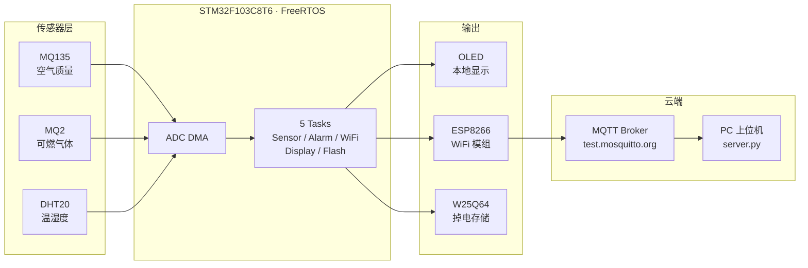

# ETMS — 实验室环境监测告警系统

[](https://www.st.com/en/microcontrollers-microprocessors/stm32f103c8.html)
[](https://www.freertos.org/)
[](https://mqtt.org/)
[](Tests/)
[](LICENSE)

一套基于 STM32 的实验室环境监测设备，实时采集可燃气体（MQ2）、空气质量（MQ135）、温湿度（DHT20），通过 WiFi 上报云端，支持本地告警和掉电数据保护。

---

## 它能做什么

- 🔥 **可燃气体泄漏告警** — MQ2 + MQ135 双传感器，阈值分级告警（LED + 蜂鸣器）
- 📡 **WiFi 实时上报** — 通过 MQTT 将传感器数据推送到云端，PC 端可实时监控
- 💾 **掉电不丢数据** — Flash 双扇区轮换存储，断电后自动恢复最近记录
- 📟 **本地 OLED 显示** — 0.96 寸屏幕实时轮播各传感器数值
- ⌨️ **串口调试终端** — 连接 UART 可查询 CPU 占用、任务栈水位、Flash 记录数

---

## 硬件连接

| 外设 | 接口 | 引脚 |
|------|------|------|
| MQ135（空气质量） | ADC1_CH1 | PA1 |
| MQ2（可燃气体） | ADC1_CH2 | PA2 |
| DHT20（温湿度） | I2C1 | PB6 / PB7 |
| W25Q64（Flash 8MB） | SPI2 | PB13 / PB14 / PB15 |
| ESP8266（WiFi） | USART3 | PB10 / PB11 |
| SSD1306 OLED | I2C1 | PB6 / PB7 |
| Buzzer + LED | GPIO | PB0 / PB1 |

---

## 系统架构



---

## 快速开始

### 硬件清单

- STM32F103C8T6 最小系统板（Blue Pill）
- ESP8266-01S WiFi 模组
- MQ135 / MQ2 / DHT20 传感器模组
- W25Q64 Flash 模组（SPI）
- 0.96" OLED（SSD1306, I2C）
- USB-TTL 串口模块

### 编译烧录

```bash
# 1. 配置 WiFi
cp User/wifi_config.example.h User/wifi_config.h
# 编辑 wifi_config.h 填入实际 SSID 和密码

# 2. Keil MDK 打开工程
Project/ETMS.uvprojx → F7 编译 → F8 烧录
```

### PC 端监控

```bash
pip install paho-mqtt
python server.py
```

连接 USART1（PA9/PA10, 115200）可进入调试终端：

```
ETMS> stats     # CPU 占用、运行时长、栈水位
ETMS> tasks     # 各任务栈剩余空间
ETMS> storage   # Flash 记录数、扇区使用情况
```

---

## 测试

```bash
cd Tests
make          # 运行全部 58 条单元测试
```

> 测试覆盖告警逻辑、传感器状态机、MQTT 报文构建、Flash 存储掉电恢复、CRC8 校验。

---

## 目录

```
ETMS/
├── User/               # 应用层
│   ├── sensor/         #   传感器采集 + 气体传感器预热状态机
│   ├── alarm/          #   告警逻辑 + 外设驱动
│   ├── wifi/           #   ESP8266 AT 驱动 + MQTT 协议 + 环形缓冲
│   ├── storage/        #   Flash 双扇区掉电安全存储
│   ├── cli/            #   UART 调试终端
│   └── ...
├── FreeRTOS/           # FreeRTOS 内核
├── Libraries/          # STM32 HAL 库
├── Tests/              # PC 端单元测试 (Unity)
├── server.py           # PC 端 MQTT 监控上位机
└── Project/            # Keil MDK 工程
```

---

## License

MIT © Yang Jichong
